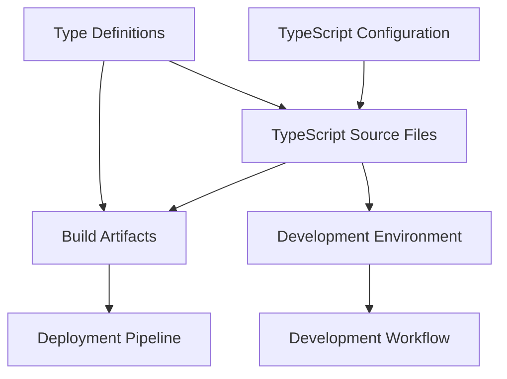

# Data Model: TypeScript Backend Migration

**Feature**: Convert Backend to TypeScript
**Created**: 2026-01-15
**Source**: [Feature Specification](spec.md)

## Overview

This document defines the TypeScript-specific data models and type definitions for the backend migration. These models provide type safety and structure for the TypeScript codebase.

## Core TypeScript Entities

### 1. TypeScript Configuration

**Entity**: TypeScriptConfiguration
**Purpose**: Defines the compiler options and project structure for TypeScript compilation

**Fields**:
- `compilerOptions`: Compiler settings including target ES version, module system, strict mode, and path mappings
- `include`: Array of file patterns to include in compilation
- `exclude`: Array of file patterns to exclude from compilation
- `extends`: Configuration files to extend from
- `files`: Specific files to compile

**Relationships**:
- Referenced by all TypeScript source files
- Controls the build process output structure

**Validation Rules**:
- Must specify valid ECMAScript target version
- Must define module resolution strategy
- Strict mode settings must be consistent with project quality gates
- Path mappings must resolve to valid directories

---

### 2. Type Definitions

**Entity**: TypeDefinition
**Purpose**: Provides type information for external libraries and modules

**Fields**:
- `packageName`: Name of the npm package
- `version`: Package version
- `typesLocation`: Path to type definition files
- `scope`: Whether types are built-in, from @types packages, or custom
- `usage`: List of files/modules using these types

**Relationships**:
- Imported by TypeScript source files
- Referenced in tsconfig.json paths configuration

**Validation Rules**:
- All external dependencies must have corresponding type definitions
- Custom type definitions must be properly exported
- Type definition files must compile without errors

**Sub-Entities**:

#### Express Types
```typescript
interface ExpressTypes {
  Request: Express.Request with custom type extensions
  Response: Express.Response with custom type extensions
  Application: Express.Application configuration
  RequestHandler: Middleware function signatures
}
```

#### Database Types
```typescript
interface DatabaseTypes {
  Connection: PostgreSQL connection configuration
  QueryResult: Result<T> from pg module
  Transaction: Database transaction interface
  Pool: Connection pool configuration
}
```

#### JWT Types
```typescript
interface JWTTypes {
  Payload: JWT payload structure with user information
  Secret: Secret key type (string or Buffer)
  Token: Complete JWT token string
  Options: Signing and verification options
}
```

#### Model Types
```typescript
interface ModelTypes {
  Employee: Employee entity with validation
  Department: Department entity with relationships
  LeaveRequest: Leave request with status enum
  Position: Position with hierarchy level
  PayStub: Financial record with calculated fields
  AuditLog: Audit trail with metadata
}
```

---

### 3. Build Artifacts

**Entity**: BuildArtifact
**Purpose**: Represents compiled JavaScript files generated from TypeScript source

**Fields**:
- `sourceFile`: Original .ts file path
- `outputFile`: Compiled .js file path
- `declarationFile`: Generated .d.ts file (if applicable)
- `sourceMap`: Source map file path
- `size`: Output file size in bytes
- `compilationErrors`: List of compilation errors (if any)

**Relationships**:
- Generated from TypeScript source files
- Input to deployment pipeline
- Source maps enable debugging in production

**Validation Rules**:
- All TypeScript source files must compile successfully
- Source maps must be generated for debugging
- Build artifacts must be optimized for production

**State Transitions**:
- `Pending` → `Compiling` → `Success` (when compilation succeeds)
- `Pending` → `Compiling` → `Failed` (when compilation errors occur)

---

### 4. Development Environment

**Entity**: DevelopmentEnvironment
**Purpose**: Defines the setup for TypeScript development and type checking

**Fields**:
- `typeChecker`: TypeScript compiler instance for type checking
- `watchMode`: Configuration for file watching and incremental compilation
- `integratedDevelopmentEnvironment`: IDE-specific settings (VS Code, WebStorm)
- `debugging`: Debug configuration with source maps
- `hotReload`: Configuration for hot module replacement

**Relationships**:
- Used by all development processes
- Configured by package.json scripts
- Integrated with nodemon for file watching

**Validation Rules**:
- Type checking must complete within 1 second (SC-003)
- Hot reload must maintain application state
- Debugging must work with source maps
- IDE integration must provide real-time type feedback

---

## Entity Relationships



## Data Flow

1. **Configuration Phase**
   - TypeScript configuration defines compiler options
   - Type definitions imported for all dependencies
   - Development environment initialized

2. **Compilation Phase**
   - TypeScript source files compiled to JavaScript
   - Type checking performed in parallel
   - Build artifacts generated with source maps
   - Declaration files created for library consumers

3. **Development Phase**
   - Watch mode monitors file changes
   - Type checking runs incrementally
   - Hot reload updates running application
   - Debugging uses source maps

4. **Quality Assurance**
   - Type checking validates all files
   - Build artifacts validated for errors
   - Performance metrics collected
   - Coverage reports generated

## Validation Constraints

### Type Safety Requirements
- All functions must have explicit return types
- All parameters must have explicit type annotations
- No `any` types allowed (except external library compatibility)
- Strict null checks enabled
- Strict property initialization checks enabled

### Performance Constraints
- Type checking completion time: < 1 second for incremental changes
- Full compilation time: < 10 seconds for entire codebase
- Memory usage: < 512MB for type checking process
- Bundle size: No increase from JavaScript baseline

### Quality Gates
- Zero TypeScript compilation errors
- 100% type coverage for custom entities
- All tests pass with type checking enabled
- No implicit `any` types
- Source maps generated for all compiled files

## Migration Strategy Entities

### 1. MigrationPhase
**Purpose**: Track progress through migration stages

**States**:
- `Setup`: Installing dependencies and configuring TypeScript
- `Infrastructure`: Converting config and build files
- `Core`: Migrating models and utilities
- `Features`: Migrating routes and services
- `Testing`: Updating tests to TypeScript
- `Polish`: Final optimizations and cleanup

**Validation**: Each phase must complete before next phase begins

### 2. BackwardCompatibility
**Purpose**: Ensure existing functionality works during migration

**Requirements**:
- API contracts unchanged
- Database schema unchanged
- External interfaces preserved
- Performance characteristics maintained

**Validation**: All existing tests pass throughout migration

## Indexes

### Primary Entities
- TypeScript Configuration
- Type Definitions
- Build Artifacts
- Development Environment

### Supporting Entities
- Express Types
- Database Types
- JWT Types
- Model Types
- Migration Phase
- Backward Compatibility

---

**Document Version**: 1.0
**Last Updated**: 2026-01-15
**Next Review**: After Phase 1 completion
